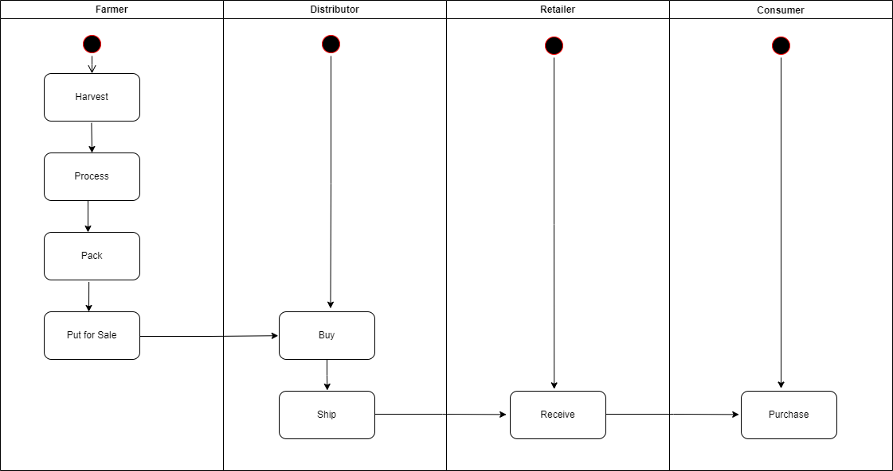
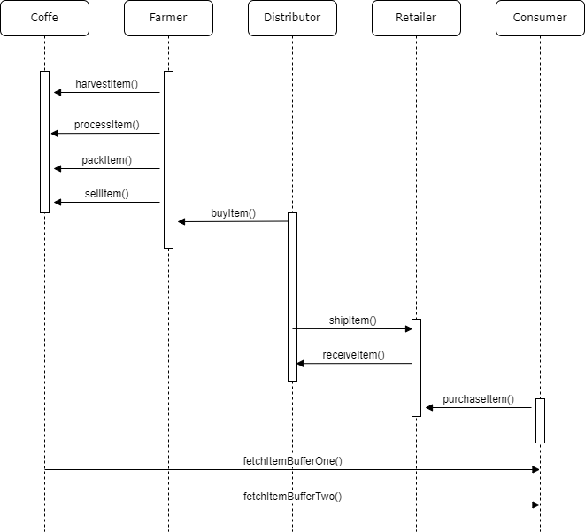
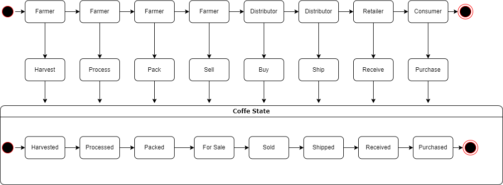
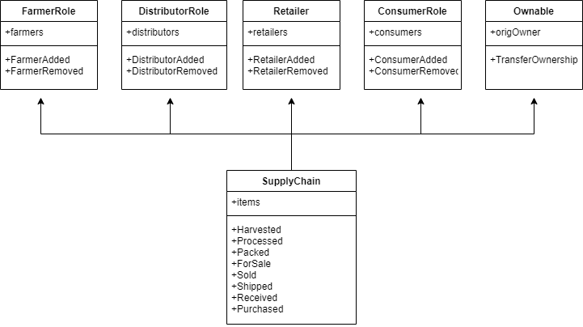

### UML

#### Activity Diagram




#### Sequence Diagram




#### State Diagram




#### Class Diagram




### Library and dependencies used

```json
"dependencies": {
    "solc": "^0.8.11",
    "truffle-hdwallet-provider": "^1.0.17",
    "web3": "^1.7.0"
  }
```

### IPFS

` No IPFS used`

### Program Version Numbers

```ABAP
Truffle v5.4.32 (core: 5.4.32)
Solidity - 0.8.0 (solc-js)
Node v14.17.4
Web3.js v1.5.3
```

### General

#### steps:

- Analyzed and understood business logic and supply chain.
- Implemented UML diagrams based on the requirements.
- Implemented smart contracts using solidity and inheritance.
- Tested smart contracts for its functionalities and security.
- Deployed to the Ropsten test network.
- Provided front end for users to interact.

#### Contract Address (Ropsten):

` 0x00bB4b46A220b13205be59f45078547dCF87Ec73`
